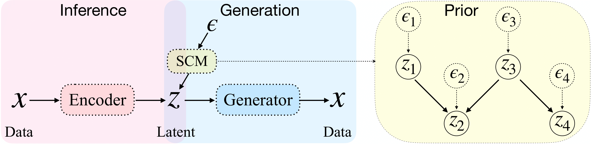
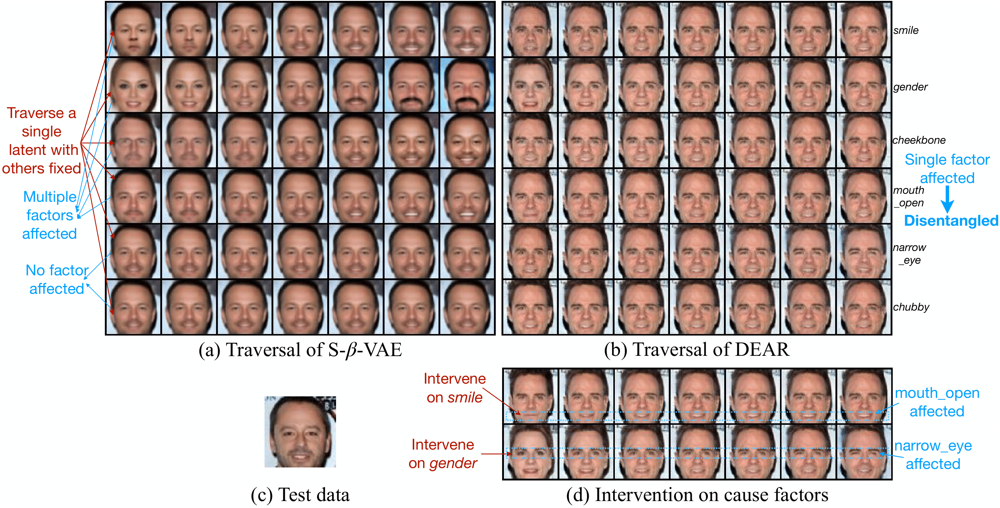
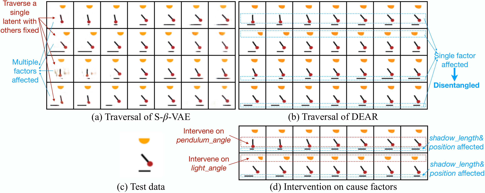

# Weakly Supervised Disentangled Generative Causal Representation Learning

This repository contains the code for the paper [*Weakly Supervised Disentangled Generative Causal Representation Learning*](https://www.jmlr.org/papers/volume23/21-0080/21-0080.pdf) published at JMLR.

## Model


## Install prerequisites
```
pip install -r requirements.txt
```

## Datasets
- [CelebA](http://mmlab.ie.cuhk.edu.hk/projects/CelebA.html)
- [Pendulum](https://drive.google.com/file/d/1lcd4E4voxpPIbeGSjsJCkJteVUfJpprB/view?usp=sharing): the dataset is generated based on the source code from [this repository](https://github.com/huawei-noah/trustworthyAI/blob/master/research/CausalVAE/causal_data/pendulum.py).

## Run

- Run DEAR on CelebA:
```
sh run_celeba_smile.sh
```
- Run DEAR on Pendulum:
```
sh run_pendulum.sh
```


### Output
This will create a directory `./results/<dataset>/<save_name>` which will contain:

- **model.sav**: a Python distionary containing the generator, encoder, and discriminator.
- **gen.png**: generated images.
- **recon.png**: real images (odd columns) along with the reconstructions (even columns).
- **trav.png**: traversal images.  
- **log.txt**: All losses computed during training.
- **config.txt**: training configurations.

### Help
Important arguments:

```
Generative model:
  --latent_dim          	dimension of the latent variable
  --prior {linscm, nlrscm, gaussian, uniform}
                        	prior distribution p_z (linear SCM, Nonlinear SCM, or independent ones)
  --labels {smile, age, pend}
                        	name of the underlying structure
                     
Supervised regularizer:
  --sup_coef          		coefficient of the supervised regularizer
  --sup_prop          		proportion of supervised labels
  --sup_type {ce, l2}		type of the supervised loss

Dataset:
  --dataset          		name of the data
  --data_dir          		directory of the dataset
```

## Results

CelebA:


Pendulum:



## Contact information
If you meet any problems with the code, please submit an issue or contact Xinwei Shen (`xinwei.shen@connect.ust.hk`).

## Citation
If you would refer to or extend our work, please cite the following paper:
```
@article{JMLR:v23:21-0080,
  author  = {Xinwei Shen and Furui Liu and Hanze Dong and Qing Lian and Zhitang Chen and Tong Zhang},
  title   = {Weakly Supervised Disentangled Generative Causal Representation Learning},
  journal = {Journal of Machine Learning Research},
  year    = {2022},
  volume  = {23},
  number  = {241},
  pages   = {1--55},
  url     = {http://jmlr.org/papers/v23/21-0080.html}
}
```
